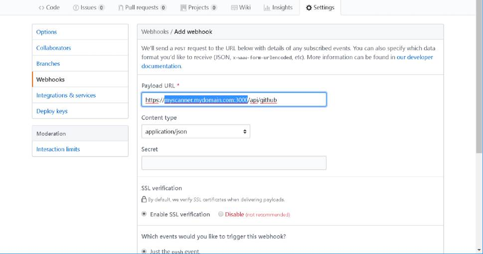
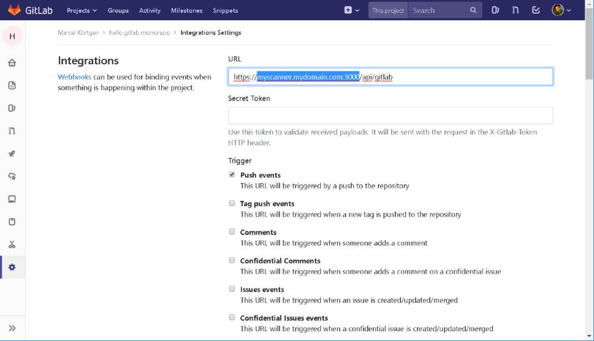
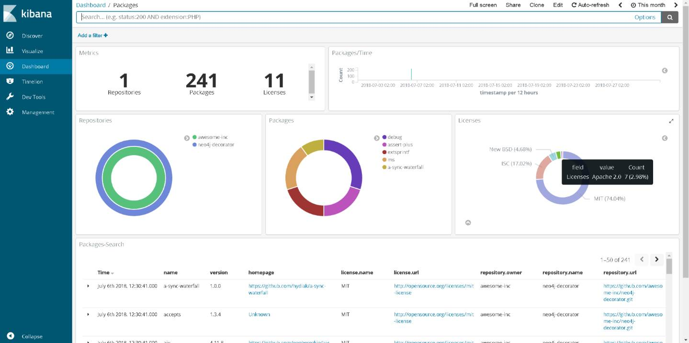

@title[Introduction]

### Automated License Compliance Analysis

---

### @fa[lightbulb] Are we legal?


---

### @fa[lightbulb] Are we legal?


---

### @fa[blogger][the cost of open source licensing compliance](http://www.industryweek.com/software-amp-systems/cost-open-source-licensing-compliance)

> Proper licensing and copyright compliance, implemented
> as part of the normal QA process, can yield savings of
> between and 40% and 65%, relative to the potential costs
> of non-compliance.

---

### Some Terminology

@ul

- [Software Asset Management (SAM)](https://www.gartner.com/reviews/market/software-asset-management-tools)
- [Software Composition Analysis (SCA)](https://resources.whitesourcesoftware.com/blog-whitesource/software-composition-security-analysis)

@ulend

---

### @fa[balance-scale] Managing Open Source Licensing

@ul

- @color[red](Do nothing) @fa[frown]
- @color[orange](Developer training and project planning) @fa[meh]
- @color[yellow](Post-dev license analysis and correction) @fa[smile]
- @color[green](Periodic assessment, automated) @fa[smile-wink]
- @color[green](Real-time preventive assistance at developer workstation) @fa[grin]

@ulend

---

### Types of Software Components

@ul

- Source Code @fa[code]
- **Dependencies** @fa[cubes] @fa[npm]
- Services @fa[cogs] @fa[docker]

@ulend

---

### Deep Code Scanning

**Example:** Scan for license notice, similar code (active research)

```c++
This file is part of Foobar.

Foobar is free software: you can redistribute it and/or modify
it under the terms of the GNU General Public License as published by the Free Software Foundation, either version 3 of the License, or (at your option) any later version.
...
```

---

### Some Code Scanners

- [nexB/scancode-toolkit](https://github.com/nexB/scancode-toolkit) @fa[github]
- [AboutCode.Org](https://www.aboutcode.org/)
- [Ninka](http://ninka.turingmachine.org/)

---

### Dependency Scanning

- [FOSSA](https://fossa.io/)
- [pivotal-legacy/LicenseFinder](https://github.com/pivotal-legacy/LicenseFinder) @fa[github]

---

## @color[green](Demo)

+++

### STEP 1. Deploy license scanner

Using git

```console
git clone https://github.com/mkoertgen/license.automation.git
cd license.automation
docker-compose up -d
```

@[1-2](Clone repository)
@[3](Startup containers)

+++

### STEP 2. Add webhook (Github)

@fa[github] _Settings -> Webhook -> Add webhook_



+++

### STEP 2. Add webhook (Gitlab)

@fa[gitlab] _Settings -> Integration_



+++

### STEP 3. View dashboard @fa[chart-line]

Review licenses in [Kibana dashboard](http://localhost:5601)



---

### @fa[donate] Costs of Licensing Policy Violations

@ul

- @color[red](**$20,000**) cost of licensing non-compliance discovered @color[red](**in the field**)
- @color[yellow](**$1,500**) cost of licensing non-compliance discovered @color[yellow](**during QA**)
- @color[green](**$40**) to fix policy violation @color[green](**at developer's workstation**)

@ulend

---

### @fa[eye] Observations from Analysis Scenarios

@ul

- @color[red](The larger the project), the higher the probability of compliance violations
- @color[orange](Ignoring licensing compliance can be costly), and it is @color[orange](**difficult to put an upper limit**) on the cost of shipping non-compliant software
- @color[green](Corrective analysis, using automated tools)periodically/during QA reduces overall cost significantly

@ulend

---

### Questions?

Reach out <br/>

@fa[twitter gp-contact](@mkoertg)

@fa[github gp-contact](mkoertgen)

@fa[medium gp-contact](@marcel.koertgen)
